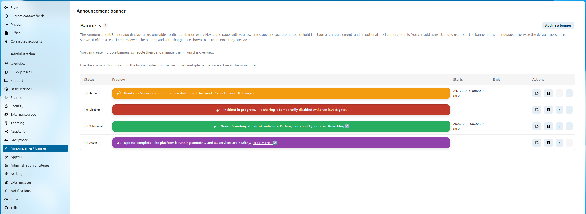
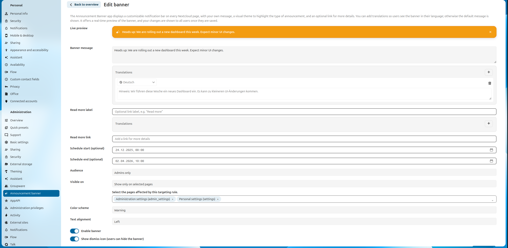
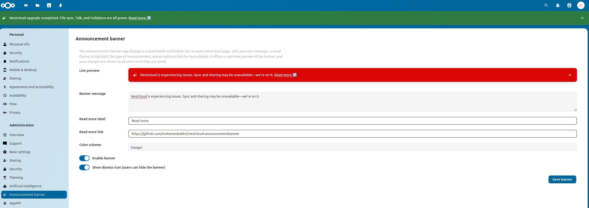
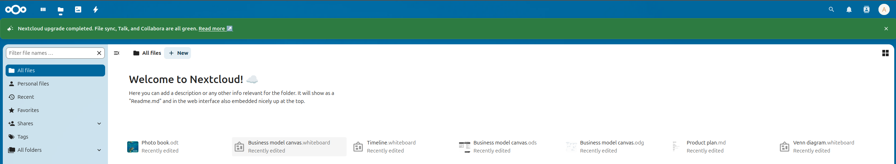
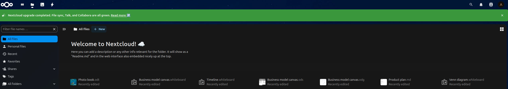
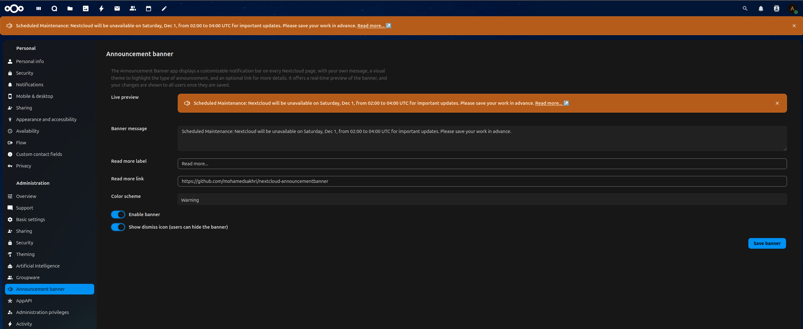
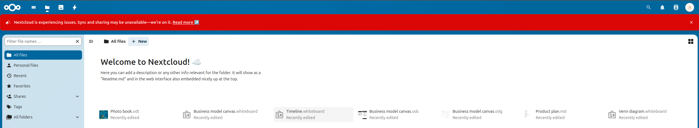
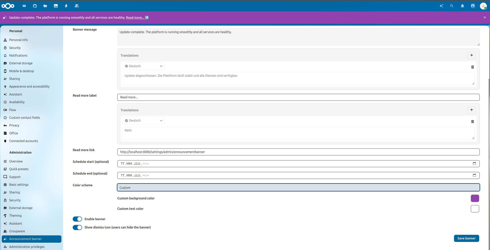

<p align="center">
  
</p>

# Announcement Banner App

The Announcement Banner App adds customizable notification bars at the top of your Nextcloud pages. Create multiple banners with their own message, color scheme, schedule window, audience, page targeting, optional “read more” link, and dismiss behavior. You can also add translations so users see the banner in their language. A live preview and an overview of all banners are available in the admin settings.

## Table of Contents

- [Features](#-features)
- [Installation](#-installation)
- [Configuration](#️-configuration)
- [Screenshots](#️-screenshots)
- [Multiple Banners](#-multiple-banners)
- [Audience](#-audience)
- [Page Targeting](#-page-targeting)
- [Schedule](#-schedule)
- [Delegation](#-delegation)
- [Command Line (occ)](#-command-line-occ)
- [Theme](#-theme)
- [Translations](#-translations)
- [Requirements](#-requirements)
- [How you can support this project](#-how-you-can-support-this-project)

## ✨ Features

- Multiple banners with per-banner settings and lifecycle status.
- Overview list with status (active, scheduled, expired, disabled), preview, audience, app scope, schedule columns, and inline actions.
- Manual banner ordering with up/down controls in the admin overview to define the display order when multiple banners are active.
- Optional schedule: set a start time, an end time, or both to control when a banner is shown.
- Audience targeting: show each banner to everyone, admins only, or specific groups with an exclude mode ("everyone except these groups") and any/all group matching.
- Page targeting: limit a banner to specific Nextcloud apps and settings pages such as `files`, `deck`, `settings` (personal settings), or `admin_settings` (administration settings).
- Theme variants: info, success, warning, danger, custom.
- Optional dismiss button for users.
- Optional “read more” link with customizable label and URL.
- Text alignment control (left, center, right) for banner content.
- Translations for banner message and read-more label (fallback to default).
- Live preview in the admin settings; changes take effect for users after saving.
- Multi-language support (English, German, French, Spanish, …).
- Settings delegation: let specific groups manage banners without giving them full Nextcloud admin rights.
- `occ` commands to create, update, list, and delete banners, so banners can be scripted (e.g. from a cron job, deployment pipeline, or backup script).

## 🚀 Installation

Install from the Nextcloud App Store: [Announcement Banner](https://apps.nextcloud.com/apps/announcementbanner).

## ⚙️ Configuration

- **Add new banner** to create a new message; manage all banners from the overview.
- **Overview order controls**: Use the arrow buttons in the actions column to change the order in which active banners are shown.
- **Banner message**: Text to display.
- **Color scheme**: Info, Success, Warning, Danger, Custom (custom background/text colors).
- **Text alignment**: Left, Center, Right.
- **Enable banner** toggle.
- **Dismiss icon** toggle (allow users to hide the banner).
- **Read more**: Optional label + URL (shown inline with an arrow icon).
- **Schedule**: Optional start date, end date, or both. Make sure to enable the banner if you want to schedule it.
- **Audience**: Everyone, Admins only, or Specific groups.
- **Apps**: Optional selection of target pages. Leave empty to show the banner everywhere, or target entries like Files, Deck, Personal settings (`settings`), or Administration settings (`admin_settings`).
- **Translations**: Optional per-language overrides for message and read-more label; default text is the fallback.
- Live preview updates immediately; saving publishes to all users.

## 🖼️ Screenshots

**Admin Overview**



**Banner Settings**



**Admin Preview**



**Success (Light)**



**Success (Dark)**



**Warning**



**Danger**



**Custom Colors**



## 📚 Multiple Banners

Create and manage several banners at once. Each banner can be enabled or disabled independently and has its own message, theme, audience, app scope, schedule, and link settings. When multiple banners are active at the same time, you can change their order from the overview.

## 👥 Audience

Choose who should see each banner. You can publish a banner to everyone, restrict it to admins only, or target specific groups.

When targeting specific groups, a **"Show this banner to"** dropdown picks exactly who within (or outside) the selected groups sees it:

- **Anyone in at least one selected group** (default) — the classic "OR" match.
- **Only people in every selected group** — requires membership in all selected groups at once ("AND" match).
- **Everyone except people in at least one selected group** — hides the banner from anyone in any selected group; everyone else sees it (including users with no session at all).
- **Everyone except people in every selected group** — hides the banner only from viewers who are members of _every_ selected group simultaneously; someone in just one of them still sees it.

## 🎯 Page Targeting

Choose where each banner should appear. You can leave the page selection empty to show a banner everywhere, or restrict it to selected apps and settings areas such as Files, Deck, Personal settings, or Administration settings.

## 🕒 Schedule

Scheduling is optional. Set only a start date, only an end date, or both to control the time window in which a banner is visible.

## 🔐 Delegation

Announcement Banner supports Nextcloud's [settings delegation](https://docs.nextcloud.com/server/latest/admin_manual/groupware/delegation.html), so you can let a group manage banners without making its members full server admins.

**How to grant access:**

1. As a full admin, go to **Administration settings → Delegation**.
2. Find **Announcement banner** in the list of delegatable settings.
3. Select one or more groups that should be allowed to manage it.

Once granted, members of that group get an **Announcement banner** entry in their Administration settings, where they can create, edit, reorder, and delete banners exactly like a full admin would — but nothing else in Administration settings becomes accessible to them.

**Scope of access:** delegation for this app is scoped to its own configuration only. A delegated group can manage banners, but cannot read or change settings belonging to any other app, and cannot grant itself (or anyone else) further admin rights.

## 💻 Command Line (occ)

Banners can be managed from the command line, which is useful for scripting an announcement around a maintenance window (e.g. warn users, switch to a "maintenance in progress" banner, then confirm completion).

**Create a banner:**

```
occ announcementbanner:create "Backup starts in 15 minutes. Please save your work." \
  --variant=warning \
  --start="2026-08-26 14:45" \
  --end="2026-08-26 15:00" \
  --no-dismiss
```

This prints the new banner's id, which you can reuse to update or delete it later.

**Create a banner with a custom colour:**

```
occ announcementbanner:create "Scheduled network maintenance tonight." \
  --variant=custom \
  --background="#6f42c1" \
  --text-color="#ffffff"
```

`--background`/`--text-color` are only applied when `--variant=custom`; both must be valid hex colours (e.g. `#fff`, `#6f42c1`, or `#6f42c1cc` with alpha).

**Update a banner** (only the passed options change; everything else keeps its current value):

```
occ announcementbanner:update <id> \
  --variant=danger \
  --message="Backup in progress. Please do not close your session." \
  --no-dismiss
```

```
occ announcementbanner:update <id> \
  --variant=success \
  --message="Backup finished. You can continue your work." \
  --dismiss
```

**List banners:**

```
occ announcementbanner:list
occ announcementbanner:list --output=json
```

**Delete a banner:**

```
occ announcementbanner:delete <id>
```

**Audience targeting:**

```
# admins only
occ announcementbanner:create "Admins: check the update log." --audience=admins

# only members of "backup-team" see it
occ announcementbanner:create "Backup running" \
  --audience=groups --groups=backup-team --groups-mode=only --groups-match=any

# everyone EXCEPT members of "backup-team" sees it
occ announcementbanner:create "Standard notice" \
  --audience=groups --groups=backup-team --groups-mode=exclude

# must be a member of every listed group at once
occ announcementbanner:create "Cross-team notice" \
  --audience=groups --groups=admin,backup-team --groups-mode=only --groups-match=all
```

`--audience=groups` requires at least one `--groups` entry.

**Page targeting:**

```
# only shown on Files
occ announcementbanner:create "Files banner" --apps=files --apps-mode=only

# shown everywhere except Administration settings
occ announcementbanner:create "Not on admin settings" --apps=admin_settings --apps-mode=exclude
```

`--apps-mode=only` or `--apps-mode=exclude` require at least one `--apps` entry; `--apps-mode=all` (the default) ignores `--apps` and shows the banner everywhere.

Common options for `create` and `update`:

| Option | Description |
| --- | --- |
| `--variant` | `info`, `success`, `warning`, `danger`, or `custom` |
| `--background`, `--text-color` | Custom hex colors, used with `--variant=custom` |
| `--align` | `left`, `center`, or `right` |
| `--start`, `--end` | Schedule window (any format understood by PHP's `DateTime`) |
| `--no-dismiss` / `--dismiss` | Disable/enable the dismiss (close) icon |
| `--link-text`, `--link-url` | Optional "read more" link |
| `--audience` | `all`, `admins`, or `groups` |
| `--groups` | Comma-separated group ids, used when `--audience=groups` |
| `--groups-mode` | `only` (restrict to these groups) or `exclude` (everyone except these groups) |
| `--groups-match` | `any` (member of at least one group) or `all` (member of every group) |
| `--apps` | Comma-separated app/settings ids to target, e.g. `files,deck,settings,admin_settings` |
| `--apps-mode` | `all` (everywhere, default), `only`, or `exclude` |
| `--message-translations`, `--link-text-translations` | JSON objects mapping locale to translated text, e.g. `'{"de":"Text"}'` |

`create` also accepts `--disabled` (create inactive), and `update` accepts `--enable`/`--disable`.

**Full option list:** each command's help is generated automatically, so you don't need to rely on this table:

```
occ help announcementbanner:create
occ help announcementbanner:update
occ help announcementbanner:list
occ help announcementbanner:delete

# equivalent form
occ announcementbanner:create --help
```

`occ list announcementbanner` also lists all four commands with their one-line descriptions.

## 🎨 Theme

Choose between info, success, warning, and danger presets, or switch to the custom theme to define your own background and text colors.

## 🌍 Translations

Add per-language overrides for the banner message and the read-more label. Users will see the translation matching their Nextcloud language, and the default text is used if no translation is provided.

## 📋 Requirements

- Nextcloud >= 30

## 🤝 How you can support this project

- 🌟 Star the [repository](https://github.com/mohamedsakhri/nextcloud-announcementbanner): it is the simplest way to support the project.
- ⭐ Rate and comment on Announcement Banner in the [Nextcloud App Store](https://apps.nextcloud.com/apps/announcementbanner).
- 🪲 Report bugs on the [issue tracker](https://github.com/mohamedsakhri/nextcloud-announcementbanner/issues).
- 📖 Help improve translations:
  - Improve language files if they need correction.
  - Add files for your language if it is not supported yet.
